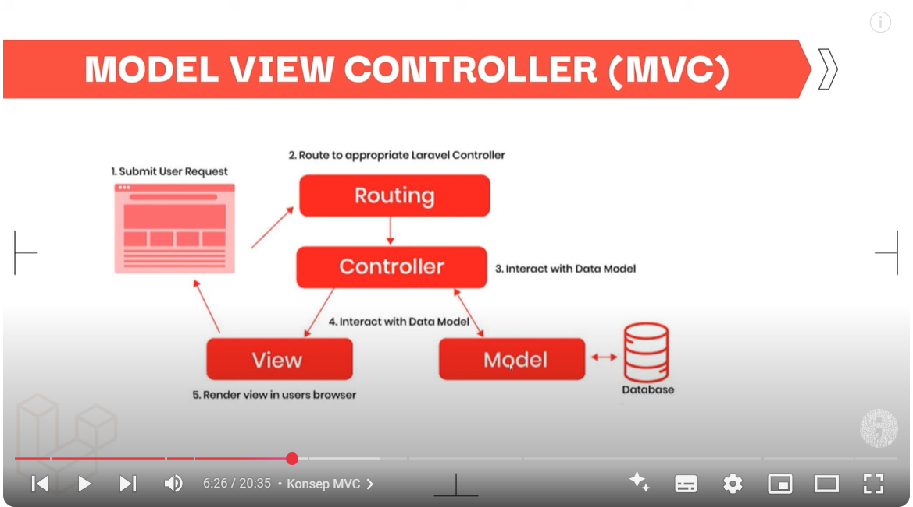

## Demo



# Belajar Laravel 11 | 9. Eloquent ORM & Post Model


Cara Membuat 2 kali sekaligus model dan migrasi

```bash
  php artisan make:model Post -m
```

Refresh migrate, jadi semua akan hilang di databasenya

```bash
  php artisan migrate:fresh
```

menigisi database mengunakan tinker

```bash
  php artisan tinker
```

```bash
  > App\Models\Post::create([
    'title' => 'Judul Artikel',
    'author' => 'Fansya',
    'slug' => 'judul-artikel-1',
    'body' => 'lalalayeyey'
  ]);
```
jangan lupa pada saat menuliskan create ini harus ada fillable

```bash
  protected $fillable = ['title', 'author', 'slug', 'body'    ];

```

untuk melihat seluruh data
```bash
  > App\Models\Post::all()
```

kalau mau pengen liat data dan menipulasi datanya/ mengambil data pertama saja
```bash
  > $posts = App\Models\Post::all()

  $posts->first() //untuk mengambil data pertama
  $posts->last() //untuk mengambil data terakhir

  //mau mencari post yang id nya 4

  $posts->find(4)

 // mengambil 1 variabel post
 $post = $posts->find(4)

 //menghapus post
 $post->delete()
 =true
```